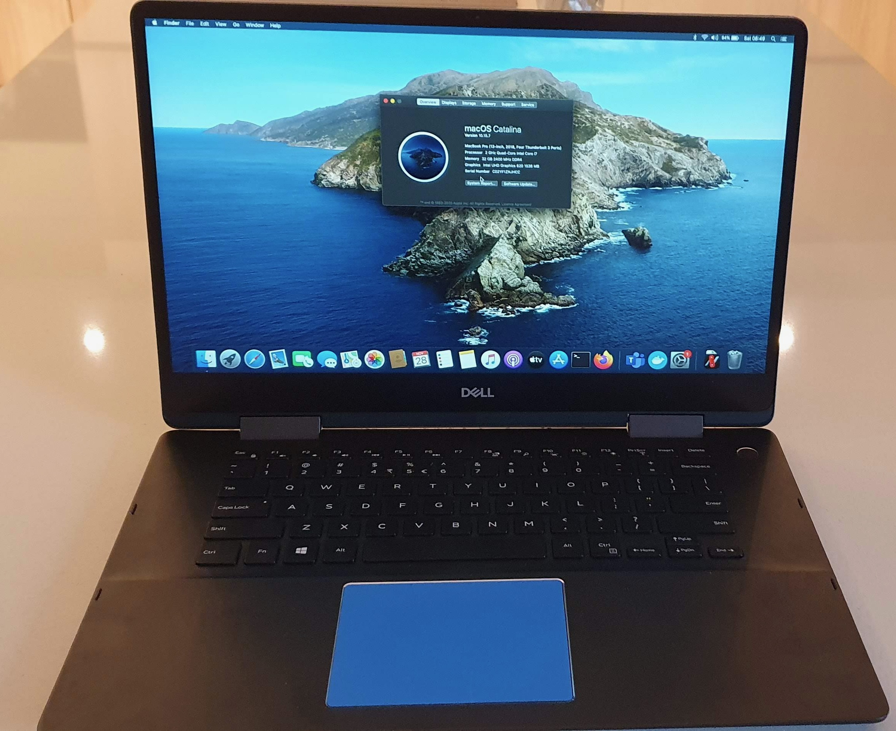
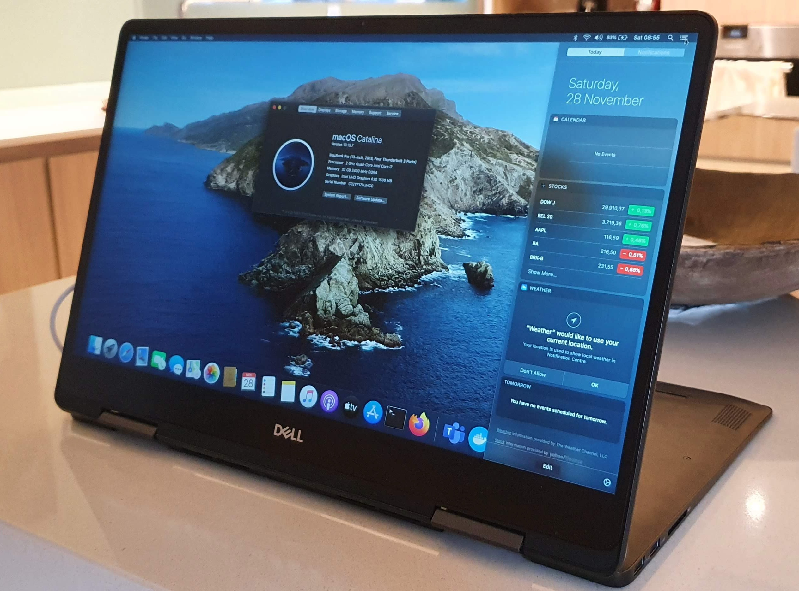
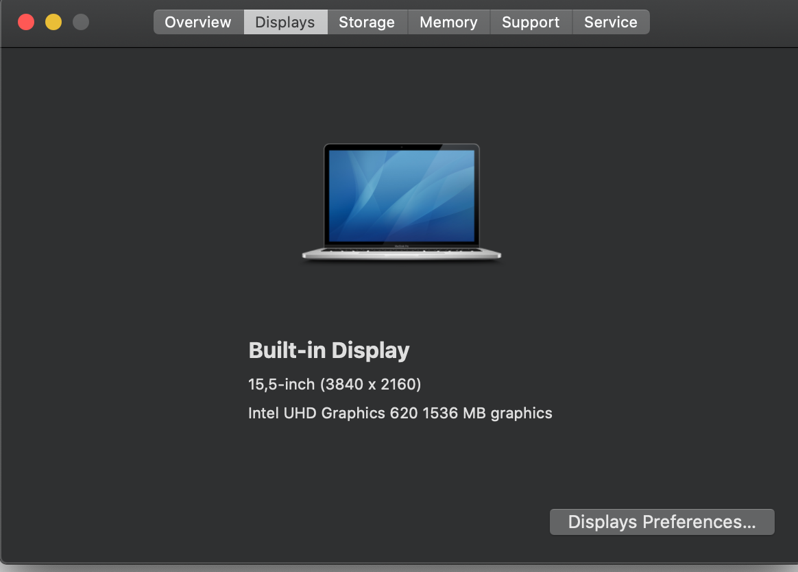
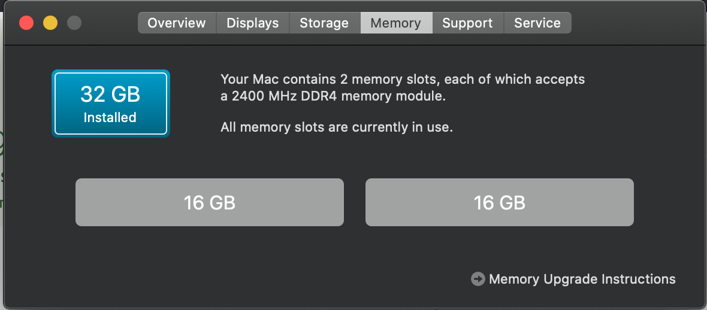
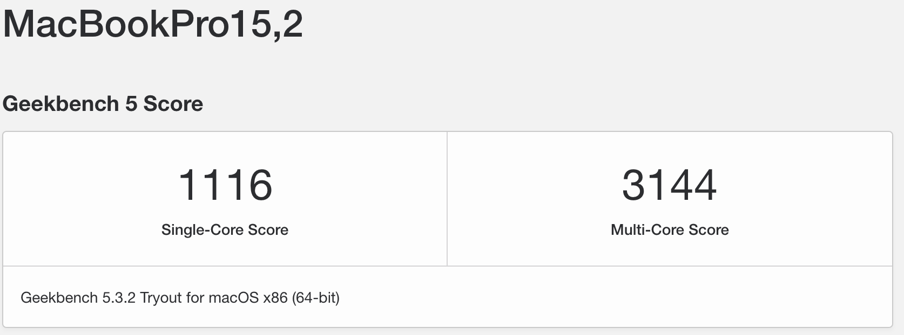
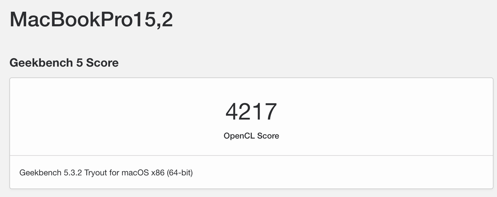
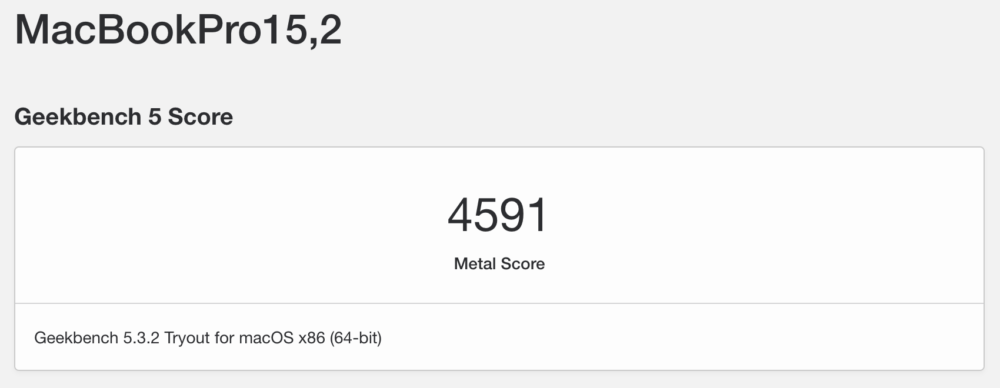

# Dell Inspiron 7586 2 in 1 convertable laptop running macOS Catalina 10.15.7
OpenCore configuration for the Dell Inspiron 7586 2 in 1

# What is working
- Wifi
- Graphics card U620
- Touch Screen, yes!
- Intel i7 8565U
- 32 GB RAM
- External USB 3.0 HDD
- External USB Mouse
- Battery info seems correct
- Audio, via alpid 77, no headphone jack
- USB C Dongle `DELL DA300HDMI`: HDMI, USB3 and RJ45 Ethernet
- Bluetooth headset (Mic does not work, and probably never will)
- Bluetooth speaker
- SD Card Reader

# Not working
- Wifi networks that require additional credentials (prompt for login does not appear), also the connection is unstable on these Wifi networks, network card resets and re-connection is required, A workaround for this can be found below
- Macs Fan Control sensor readout, but the fans work
- TG PRO Fan control readout does not work, but the sensors work
- Use Macs Fan Control for managing the fans, use TG Pro for the sensors
- Bluetooth Logitech Mouse
- Sleep, closing the lid, resuming...
- HDMI Port in the chassis (this is linked to the MX150 dGPU)
- Native DRM (only software accelerated, **Netflix works in FireFox**)

 
 
 
 
 
 
 
 

# Details of this setup

OpenCore version is 0.6.5

Started from scratch using Dortania's Guide https://dortania.github.io/OpenCore-Install-Guide/

PlatformInfo was generated using Dortania's Guide https://dortania.github.io/OpenCore-Install-Guide/config-laptop.plist/coffee-lake.html#platforminfo
**This is missing in the config.plist** 

Please generate your own using GenSMBIOS: https://github.com/corpnewt/GenSMBIOS
Use `MacBookPro15,2`

Details of the target machine:
- Dell Inspiron 7586 2 in 1
- BIOS `1.7.1`, upgraded to `1.8.0`
- 8th Generation Intel(R) Core(TM) `i7-8565U` Processor (8MB Cache, up to 4.6 GHz), BIOS Device name `_SB_.PR00` Processor ID from BIOS `806EB`
- Intel UHD 620 (device id `0x3EA0`, BIOS Device name `_SB_.PCI0.GFX0` (Whiskey Lake)
- AudioCodec `ALC3254`
- Intel Wireless 9560 `0x9Df0`
- NVIDIA GeForce MX150 2GB GDDR5 (not needed or either supported in macOS, will be disabled) BIOS Device name `_SB__.PCI0.RP05.PEGP` `0x1D10 GP108M`
- 512GB M.2 PCIe NVMe Solid State Drive
- 15.6-inch UHD (3840 x 2160) 4K `Touch Screen`
- Fingerprint sensor (discovered, but not supported)
- Originally had 16GBx1, DDR4, 2666MHz, **replaced with 2x Crucial 16 GB SODIMM DDR4-2400** https://www.crucial.com/memory/ddr4/ct16g4sfd824a

BIOS Information:
- Enable Legacy Option ROMs: **OFF**
- SATA Operation: **AHCI**
- Drives: **only M.2 PCIe SSD-0 (512GB) is enabled**
- SMART reporting: **OFF**
- PPT Security, PTT: **OFF**
- Secure Boot: **OFF**
- Intel SGX: **Disabled**
- Multi Core support: **All**
- Intel SpeedStep: **ON**
- C States: **ON**
- Intel Turbo Boost: **ON**
- HyperThread: **Enabled**
- Intel Speed Shift: **ON**
- USB Wake: **OFF**
- Block sleep: **OFF**
- FN Lock: **ON**
- FN Lock Mode: **Disable/Standard**
- Fastboot: **Thorough**
- Intel Virtualization Technology: **Enabled**
- VT for Direct I/O: **Disabled**
- Wireless and Bluetooth: **ON**
- Auto OS Recovery Threshold: **OFF**
- CFG Lock: Disabled via `modGRUBShell.efi`, unable to do so in BIOS

Details of the config.plist in ProperTree:
- Platform id: **00009B3E**
- Device id: **9B3E0000**
- Please check the entire PciRoot(0x0)/Pci(0x2,0x0) section for more info regarding the U620 on Whiskey Lake
- The order of the kexts is very important, see : https://www.tonymacx86.com/threads/guide-hp-spectre-x360-13-ap0037tu-late-2018.295518/

**CFG LOCK** disabled using Dortania's guide : https://dortania.github.io/OpenCore-Post-Install/misc/msr-lock.html#disabling-cfg-lock
BIOS 1.7.1 and 1.8.0 should all have the same entry for the CFG Lock **0x5C3**

Extracted from 

https://www.dell.com/support/home/en-us/drivers/driversdetails?driverid=9vv9w&oscode=wt64a&productcode=inspiron-15-7586-2-in-1-laptop

and 

https://www.dell.com/support/home/en-us/drivers/driversdetails?driverid=wr5v6&oscode=wt64a&productcode=inspiron-15-7586-2-in-1-laptop

Check CFL LOCK by running the modGRUBShell.efi from the OpenCore menu and entering:

```setup_var 0x5C3```

If that returns 0x01, it is locked.

To disable CFL LOCK, run the modGRUBShell.efi from the OpenCore menu and enter:

```setup_var 0x5C3 0x00```

*This needs to be repeated after a new BIOS flash!*

CFL LOCK can be re-enabled by running the modGRUBShell.efi from the OpenCore menu and entering:

```setup_var 0x5C3 0x01```

# Getting started
- Copy this repo (git clone)
- Generate your own platforminfo using [GenSMBIOS](https://github.com/corpnewt/GenSMBIOS) and the [Dortania Guide](https://dortania.github.io/OpenCore-Install-Guide/config.plist/#creating-your-config-plist) use `MacBookPro15,2` for `SystemProductName`. see the TODO in the config.plist.
- Format an USB drive using the [Dortania Guide](https://dortania.github.io/OpenCore-Install-Guide/prerequisites.html#prerequisites) (3.0 works)
- Create a macOS installation USB drive using the [Dortania Guide](https://dortania.github.io/OpenCore-Install-Guide/installer-guide/) and [gibMacOS](https://github.com/corpnewt/gibMacOS)
- Mount the EFI partition (using [MountEFI](https://github.com/corpnewt/MountEFI))
- Copy the OpenCore DEBUG files into the /Volumes/EFI/EFI directory, see Dortania Guide
- Setup your BIOS (see BIOS Information above, press F2 on boot)
- Boot via USB (press F12 on boot and select the USB drive)
- If the drive does not show up, unplug, replug and reboot (CTRL+ALT+DEL on BIOS screen)
- If the drive still does not show up, check the folder structure, there should be an EFI folder on your EFI partition that contains OC and BOOT directories
- Once you're booted into OpenCore, select the modGRUBShell.efi file
- Type ```setup_var 0x5C3``` this should return 0x01
- If it does not, your system is different from this setup and you must follow the [Dortania Guide](https://dortania.github.io/OpenCore-Post-Install/misc/msr-lock.html) to find out the parameter for your CFG LOCK! Do not proceed with this tutorial
- Now set the 0x5C3 parameter (CFG LOCK) to 0x00 ```setup_var 0x5C3 0x00```
- Check if it has been persisted type ```setup_var 0x5C3```, this should return 0x00
- Reboot on USB (F12) and select the macOS Catalina installer
- If your screen goes dark after the verbose text output, just wait a few minutes for the screen to turn back on
- Install the HeliPort.app application after macOS installation, found [here](/tools/HoRNDIS-9.2-catalina_install.pkg.zip)
- Good luck!

## Tips
- The Display does not come on for minutes after the verbose output, this is normal, you could connect an external display via an USB C Dongle (HDMI on the chassis does not work). Or just wait a few minutes.

- Turn the sleep off, on battery and power, this setup does not resume from sleep.

- Great for home use, not for professional environments, it is after all still a **HACK**intosh

- Please regenerate your own SMBIOS Data!

- Please follow the [Dortania Guide](https://dortania.github.io/OpenCore-Install-Guide/) carefully.

- Please use **ProperTree** for any modifications to your config.plist!

### Workaround for WIFI networks that require additional login information
Requirements:
- Android smartphone, I have not tested this with an iPhone
- Usb data cable

In the rare occasion when the Intel Open Wireless driver does not want to prompt the login screen for your WiFi Access Point, you can use this workaround.

1. Connect your Android smartphone to the Access Point.
2. Install the HoRNDIS 9.2 package (for Catalina) from [here](/tools/HoRNDIS-9.2-catalina_install.pkg.zip)
3. Connect your phone to your Hackintosh using a USB cable
4. Share the phone's network using USB tethering
5. Enjoy having your phone charging while having a stable WiFi on your Hackintosh

## Special thanks
Hacker1024 (superl2) for his initial work:

https://github.com/hacker1024/Dell-Inspiron-7586-Hackintosh
